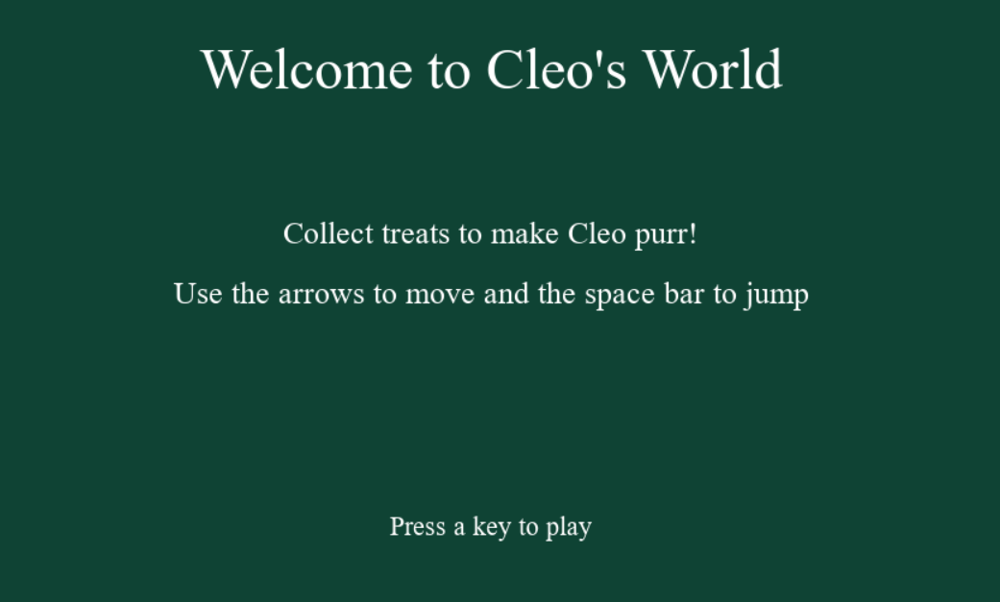
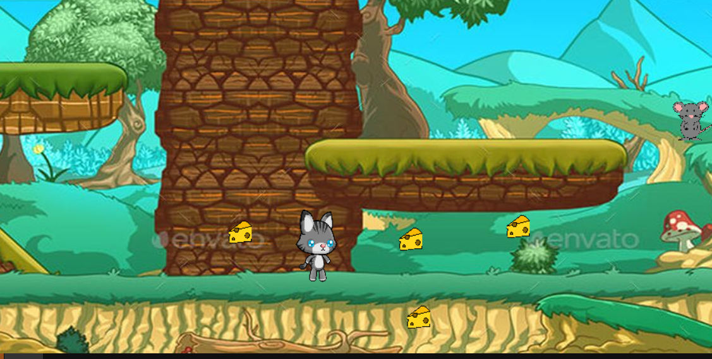

# Cleo's World

(This was created during my time as a student at Code Chrysalis.)

A fun game with a fun cat.

Let your inner cat out and live your life as Cleo-chan. Cleo is a fun and friendly cat who likes the simply things in life. Cheese and mice. Run and jump around and catch them to raise your purr points! Have fun and remember, nobody's purrfect!

### Here's a preview of the splash screen:



### This is a preview of the result screen:



## Installation

1. Please clone the repo

2. Install packages

```bash
py game.py
```

3.  Catch some mice and eat some cheese! Make Cleo happy!

## Built With

- [Python](https://www.python.org/)
- [Pygame](https://www.pygame.org/news)

## Contributing

Pull requests are welcome. For major changes, please open an issue first to discuss what you would like to change.

## License

[MIT](https://choosealicense.com/licenses/mit/)

## Created by

- [Garrett Chun](https://github.com/KapakahiCoder)
